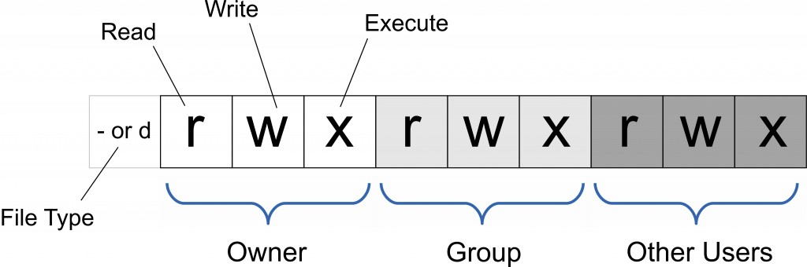
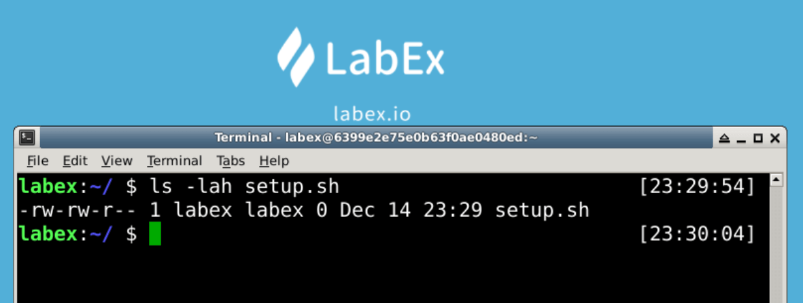
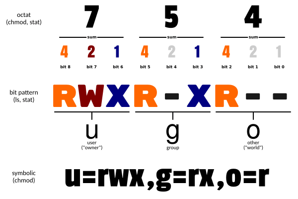
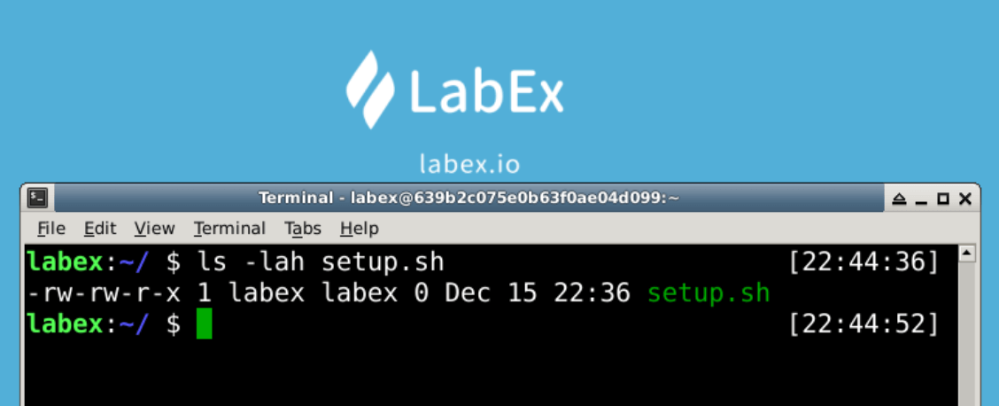

# Modify File Permissions

This challenge is about modifying the file permissions.

Before we are challenged to learn about modifying file permissions, let's first understand what we need to know about file permissions

## File Permissions

Linux/Unix file permissions are classified into three levels: Owner, Group, and Other Users.

After creating a file with `touch` command, the Owner and Group have read and write permission, but the Other Users only has read permission.

## Example

## Requirements

- Create a file named `setup.sh` in the `~` directory with `touch` command.
- Add executable permissions to Other Users of the `setup.sh` script file.
